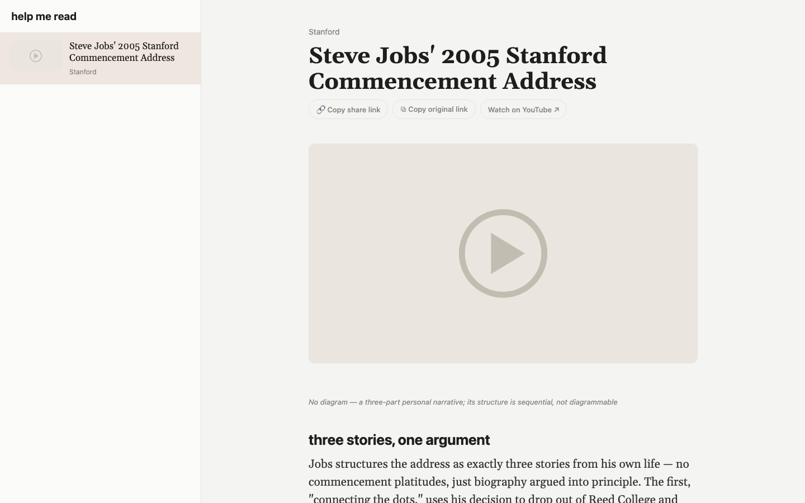

# help me read

A [Claude Code](https://claude.com/claude-code) skill that turns links you
paste — YouTube videos, blog posts, newsletter essays — into a beautiful
personal reading site, deployed to your own fixed URL.

Paste a link (or ten). The skill fetches the transcript or article, writes an
analytical overview with verified quotes and figures, adds it to your
archive, and deploys the updated site. For videos you get a player, chapter
moments with frame thumbnails, and the full transcript; for articles, the
extracted full text. Optionally, label an email in Gmail and the next run
picks it up automatically — great for Substack newsletters and podcast
emails.



## Quickstart

```bash
# 1. Clone
git clone https://github.com/talsraviv/help-me-read.git ~/help-me-read

# 2. Install the skill (a symlink into Claude's skills directory)
ln -s ~/help-me-read ~/.claude/skills/help-me-read

# 3. In Claude Code, paste a YouTube link and say "help me read this"
```

That's it. The first run detects a fresh install and walks you through
everything else: checking dependencies (`python3`, `yt-dlp`, `node`), picking
your site's address (a free `*.surge.sh` subdomain), and the optional extras.
After that, every invocation is fully autonomous — paste links, get a
deployed site.

## How it works

The pipeline is deterministic scripts with exactly one AI step:

1. **Parse** the paste into items (YouTube URL → video, other URL → article,
   bare title → YouTube search). If a Gmail label is configured, also scan
   for newly labeled emails and extract the content they point to.
2. **Fetch** — `yt-dlp` pulls metadata + transcript; articles get readable
   text extraction. Failures are queued and retried on every future run;
   nothing is ever silently lost.
3. **Write the overview** — the one AI step. A generated writer's brief
   (spec + schema + transcript, see `references/overview-spec.md`) produces
   an analytical overview: sections, figures, grounded quotes, key moments.
4. **Verify** — scripts check every quote is verbatim and every timestamp is
   where the words are actually said. The model doesn't get to grade its own
   homework.
5. **Build + deploy** — one light `index.html` plus a lazy-loaded payload
   per item, so the page stays fast forever. A smoke test gates every
   deploy; a broken build never replaces your live site.

## Your library is yours

The public machinery and your personal content are strictly separated:

- **This repo** holds only the machinery — scripts, template, tests, the
  skill. It never contains personal data.
- **`data/`** (gitignored) holds your library: items, assets, ledgers. The
  setup flow can optionally make it a private git repo so your archive is
  backed up and synced across machines.
- **`config/`** values (your domain, your Gmail label) are gitignored, with
  committed `.example` templates.
- **Fonts**: the site ships with [Gelasio](https://fonts.google.com/specimen/Gelasio)
  (SIL OFL). Prefer your own typeface — including a commercially licensed
  one? Drop `book.ttf` and `bold.ttf` into `assets/fonts-local/` (gitignored)
  and builds use them automatically.

## Requirements

- [Claude Code](https://claude.com/claude-code) (or any Claude harness that
  runs skills)
- `python3`, `yt-dlp`, `node`/`npx` — checked by `scripts/doctor.sh`, guided
  by the first-run setup
- Optional: Pillow (frame thumbnails), Chrome (pre-deploy render check),
  Gmail MCP connector (the email queue)

See [SETUP.md](SETUP.md) for details, multi-machine sync, and the privacy
design.

## License

MIT — see [LICENSE](LICENSE). The bundled Gelasio fonts are licensed
separately under the SIL Open Font License (`assets/fonts/OFL.txt`).
